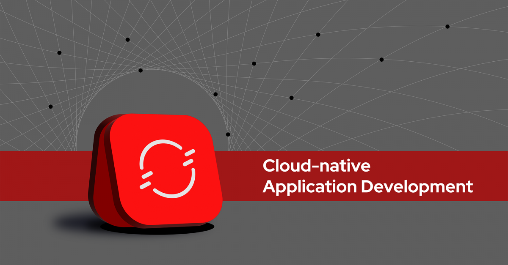

# Best Practices for Develop Cloud-Native Application

## Table of Contents

- [Deploy Cloud-Native Application with OpenShift](deploywiths2i.md)

- [Keep Application Configuration Outside Container Image](evconfigsecret.md)

