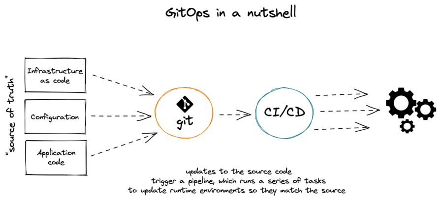
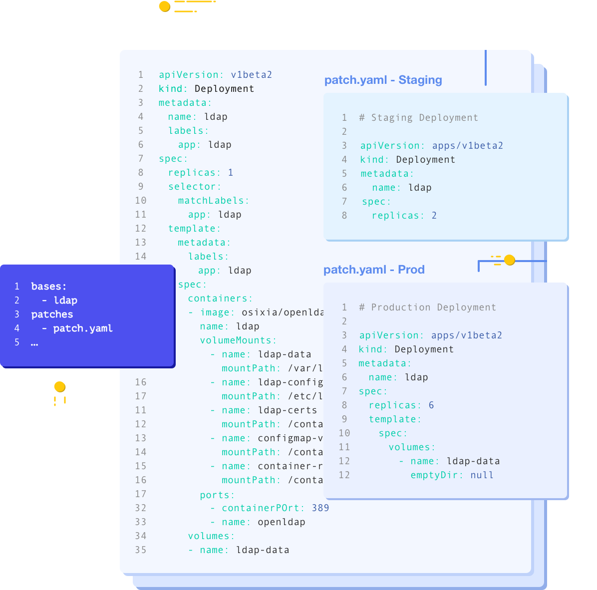
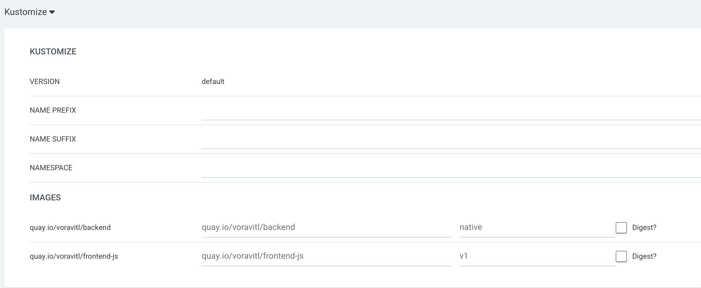

# Protect Application Availability with GitOps
<!-- TOC -->

- [Protect Application Availability with GitOps](#protect-application-availability-with-gitops)
  - [What is GitOps?](#what-is-gitops)
  - [About GitOps](#about-gitops)
  - [About Red Hat OpenShift GitOps](#about-red-hat-openshift-gitops)
  - [Review Deployment Configuration in Git Repository \& Kustomized Configuration Management](#review-deployment-configuration-in-git-repository--kustomized-configuration-management)
  - [Create Applicaiton in OpenShift GitOps](#create-applicaiton-in-openshift-gitops)
  - [Back to Table of Content](#back-to-table-of-content)

<!-- /TOC -->

## What is GitOps?

GitOps uses Git repositories as a single source of truth to deliver infrastructure as code. Submitted code checks the CI process, while the CD process checks and applies requirements for things like security, infrastructure as code, or any other boundaries set for the application framework. All changes to code are tracked, making updates easy while also providing version control should a rollback be needed.

GitOps delivers:

* A standard workflow for application development
* Increased security for setting application requirements upfront
* Improved reliability with visibility and version control through Git
* Consistency across any cluster, any cloud, and any on-premise environment
Many other tools can be used together to build a GitOps framework. For example, git repositories, Kubernetes, continuous integration/continuous delivery (CI/CD) tools, and configuration management tools.

## About GitOps

GitOps is a declarative way to implement continuous deployment for cloud native applications. You can use GitOps to create repeatable processes for managing OpenShift Container Platform clusters and applications across multi-cluster Kubernetes environments. GitOps handles and automates complex deployments at a fast pace, saving time during deployment and release cycles.

The GitOps workflow pushes an application through development, testing, staging, and production. GitOps either deploys a new application or updates an existing one, so you only need to update the repository; GitOps automates everything else.

GitOps is a set of practices that use Git pull requests to manage infrastructure and application configurations. In GitOps, the Git repository is the only source of truth for system and application configuration. This Git repository contains a declarative description of the infrastructure you need in your specified environment and contains an automated process to make your environment match the described state. Also, it contains the entire state of the system so that the trail of changes to the system state are visible and auditable. By using GitOps, you resolve the issues of infrastructure and application configuration sprawl.



GitOps defines infrastructure and application definitions as code. Then, it uses this code to manage multiple workspaces and clusters to simplify the creation of infrastructure and application configurations. By following the principles of the code, you can store the configuration of clusters and applications in Git repositories, and then follow the Git workflow to apply these repositories to your chosen clusters. You can apply the core principles of developing and maintaining software in a Git repository to the creation and management of your cluster and application configuration files.

## About Red Hat OpenShift GitOps

Red Hat OpenShift GitOps ensures consistency in applications when you deploy them to different clusters in different environments, such as: development, staging, and production. Red Hat OpenShift GitOps organizes the deployment process around the configuration repositories and makes them the central element. It always has at least two repositories:

1. Application repository with the source code

2. Environment configuration repository that defines the desired state of the application

These repositories contain a declarative description of the infrastructure you need in your specified environment. They also contain an automated process to make your environment match the described state.


Red Hat OpenShift GitOps uses Argo CD to maintain cluster resources. Argo CD is an open-source declarative tool for the continuous integration and continuous deployment (CI/CD) of applications. Red Hat OpenShift GitOps implements Argo CD as a controller so that it continuously monitors application definitions and configurations defined in a Git repository. Then, Argo CD compares the specified state of these configurations with their live state on the cluster.


Argo CD reports any configurations that deviate from their specified state. These reports allow administrators to automatically or manually resync configurations to the defined state. Therefore, Argo CD enables you to deliver global custom resources, like the resources that are used to configure OpenShift Container Platform clusters.


## Review Deployment Configuration in Git Repository & Kustomized Configuration Management
* Start with [Kustomized](https://kustomize.io)
  
  
  
  Kustomize provides a solution for customizing Kubernetes resource   configuration free from templates and DSLs.

  Kustomize lets you customize raw, template-free YAML files for multiple purposes, leaving the original YAML untouched and usable as is.

  Kustomize targets kubernetes; it understands and can patch kubernetes style API objects. It’s like make, in that what it does is declared in a file, and it’s like sed, in that it emits edited text.

  With kustomize, your team can ingest any base file updates for your underlying components while keeping use-case specific customization overrides intact. Another benefit of utilizing patch overlays is that they add dimensionality to your configuration settings, which can be isolated for troubleshooting misconfigurations or layered to create a framework of most-broad to most-specific configuration specifications.

  To recap, Kustomize relies on the following system of configuration management layering to achieve reusability:

  - Base Layer - Specifies the most common resources
  - Patch Layers - Specifies use case specific resources
  
    
    

* Review Kustomize Resource in Git Repository
  - For this workshop, we will deploy application by Red Hat OpenShift GitOps
    
    
  
  - open browser to [https://github.com/chatapazar/best-practice-2025.git](https://github.com/chatapazar/best-practice-2025.git)
  
    
  
  - go to manifest/apps-kustomize
  
    
  
  - go to base folder
  
    
  
    - review following file:
      - demo-rolebinding.yaml
      - backend.yaml
      - frontend.yaml
      - backend-service.yaml
      - frontend-service.yaml
      - route.yaml
      - kustomization.yaml
  
  - go to overlays/dev folder
  
    
  
    - review following file:
      - kustomization.yaml
      - backend.yaml
      - frontend.yaml
  
    - content of kustomization.yml
  
      
  
  - compare content of frontend.yaml between base folder and overlays/dev folder 
    
    - replicas in base/frontend.yaml
    
      ```yaml
      spec:
        replicas: 1
        template:
          spec:
      ```
    
    - replicas in overlays/dev/frontend.yaml
    
      ```yaml
      spec:
        replicas: 3
        template:
          spec:
      ```
      
  - summary kustomize structure of this workshop
    ```bash
    manifest/apps-kustomize
    ├── base
    │   ├── demo-rolebinding.yaml
    │   ├── backend.yaml
    │   ├── frontend.yaml
    │   ├── kustomization.yml
    │   ├── backend-service.yaml
    │   ├── frontend-service.yaml
    │   └── route.yaml
    └── overlays
        └── dev
            ├── backend.yaml
            ├── frontend.yaml
            └── kustomization.yml
    ```

## Create Applicaiton in OpenShift GitOps
* Login to OpenShift GitOps (ArgoCD)
  - open your developer console, go to your project 'gitops-userX' (replace X with your username)

    

  - Go to top right of developer console, Navigate to the table menu (It's to the left of the plus sign menu.) --> OpenShift GitOps --> Cluster Argo CD.
  
    
  
  - For the first time to open Argo CD Console. Your Browser will warining about connection(is not private) Because we used self sign certification. Please accecpt this risk and proceed to Argo CD Cosole
  
  - use local user for login, type your username and password (same with your openshift login), click `SIGN IN`
  
    
  
  - Review Argo CD Console
  
* Create Application
  
  - Click `NEW APP` icon from left top of console to Create Application
  
    

  - in create application panel, config following information:

    
  
  - In General part
    - Application Name: `demo-userX` 
      - change X to your username such as demo-user1
    - Project: `default`
    - SYNC POLICY: `Manual`
    - leave default for sync option

  - in Source part
    
    
    
    - set Repository URL: `https://github.com/chatapazar/best-practice-2025.git`
    - Revision: `HEAD`
    - Path: `manifest/apps-kustomize/overlays/dev`
  
  - in Destination part
    
    
    
    - Cluster URL: `https://kubernetes.default.svc`
    - Namespace: `gitops-userX`
      - change X to your username such as `gitops-user1`
  - Select Kustomize and Leave default in last part (Source Type/Kustomize)
    
    
  
  - Click Create and wait untill your application show in console
  
    
  
  - if you don't found your application (because this workshop, we share argo cd to all user). you can filter with your namespaces/project such as 'gitops-userX' 
  
    
  
  - see status of your application set to `OutOfSync`

* Sync (Deploy) Application
  - Next Step, We will start sync (deploy) application to openshift.
  - from applications panel, click your application 
  - view detail of your applicaiton
  
    
  
    - check following component:
      - service
      - deployment
      - rolebinding
      - route
  
  - click sync icon, in sync panel, leave all default and click `synchronize`
  
    
  
  - wait until current sync status change to `Synced` and last sync result change to `Sync OK`
  
    
  
    - all component change to green icon and don't have yellow icon

* Check Deployment Application in Developer Console

  - back to OpenShift Developer Console, in your topology of project `gitops-userX`
  - application deploy in your project now.
  
    
    
* View Another view in OpenShift GitOps (ArgoCD)
  - back to your application in Argo CD Console, click your application
  - in the top right of console, try to view another information of your application

    - view container deployment information on worker node

    

    - view application network flow 

    

    - view appliation component by type

    

* Test Deployment Application Diff with Deployment Configuration in Git Repository (by OpenShift GitOps)
  - back to openshift developer console, topology, click your frontend icon
  - in frontend deployment side panel, click Details tab to view information

    

  - try to scale down frontend to 1 

    

    


  - back to Argo CD, your application will change to 'OutOfSync'
  
    
    
  - click APP DIFF menu to view detail of diff, click compact diff to focus

    

* Sync to Correct Configuration
  - For sync correct config back to cluster, click sync icon, and click synchronize (leave all default)

    

  - wail until status change to 'Synced', and back to OpenShift Developer Console to view deployment back to 3 Pod

    

## Back to Table of Content
- [Best Practices for Develop Cloud-Native Application](README.md)


