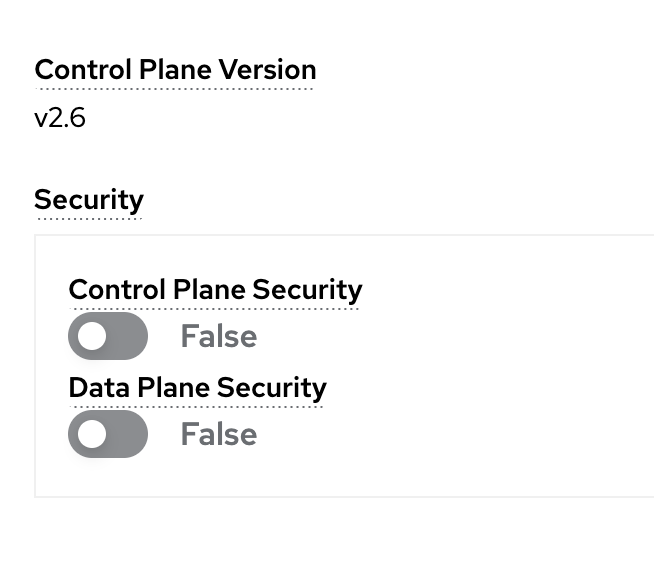

# Protect communication between applications
<!-- TOC -->

- [Protect communication between applications](#protect-communication-between-applications)
  - [Network Policy](#network-policy)
  - [Secure with mTLS (with OpenShift Service Mesh)](#secure-with-mtls-with-openshift-service-mesh)
  - [Back to Table of Content](#back-to-table-of-content)

<!-- /TOC -->


## Network Policy

- In OpenShift Web Console, Select project `userX` (change X to your username!!!)
- click Backend, click Services `backend` Link

  

- In Details tab, copy Hostname such as `backend.user1.svc.cluster.local`

  

- Change to project `scc-userX` (Change X to your username!!!)
- Click scc-tutorial-deploy-default deployment, select pod in this deployment for open terminal
- Try to call backend service with curl command line

  ```ssh
  curl -v http://backend.user1.svc.cluster.local:8080/backend
  ```
  
  example result

  

- back to project `userX` (change X to your username!!!)
- Click Search in left menu, filter in resource with `NetworkPolicy`
- Click Create NetworkPolicy

  
  
- In Create NetworkPolicy
  - Policy Name : example1
  - click Add pod selector
  
  

- set label to `app` and selector to `backend`, this policy will affect only backend pod!
- check affected pods with link

  

- In Ingress, click Add ingress rule, select Allow pods fro the same namespace

  

- Click Create, and check Ingress rules of `example1` Network Policy

  

- Test call again in web terminal, `userX` project

  ```ssh
  curl -v http://backend.userX.svc.cluster.local:8080/backend
  ```

  example result

  

- Change to project `scc-userX` (Change X to your username!!!)
- Click scc-tutorial-deploy-default deployment, select pod in this deployment for open terminal
- Try to call backend service with curl command line

  ```ssh
  curl -v http://backend.userX.svc.cluster.local:8080/backend
  ```
  
  example result

  

## Secure with mTLS (with OpenShift Service Mesh)

- Change to project `mesh-userX` (Change X to your username!!!)
  
  

- Deploy new pod withou side car! `(Don't have sidecar inject)`
- Click Import YAML, deploy with below YAML

  ```yaml
  apiVersion: apps/v1
  kind: Deployment
  metadata:
    name: mtls
  spec:
    selector:
      matchLabels:
        app: mtls
    template:
      metadata:
        labels:
          app: mtls
      spec:
        containers:
        - image: ubi8/ubi-minimal
          name: ubi-minimal
          command: ['sh', '-c', 'echo "Hello from user $(id -u)" && sleep infinity']
          volumeMounts:
          - mountPath: /var/opt/app/data
            name: data
        serviceAccountName: default
        volumes:
        - emptyDir: {}
          name: data
   ```

- wait until application deploy success and running, go to terminal of pod in `mtls` deployment.

  

- try to call frontend with below command line

  ```ssh
  curl -v http://frontend:8080
  ```

- `(This Step action by Admin User of OSSM Control Plane)`
  - go to Service Mesh Control Plane, set Data Plane Security to True

  

- Test call frontend again from `mtls` deployment
  
  

## Back to Table of Content
- [Best Practices for Develop Cloud-Native Application](README.md)


