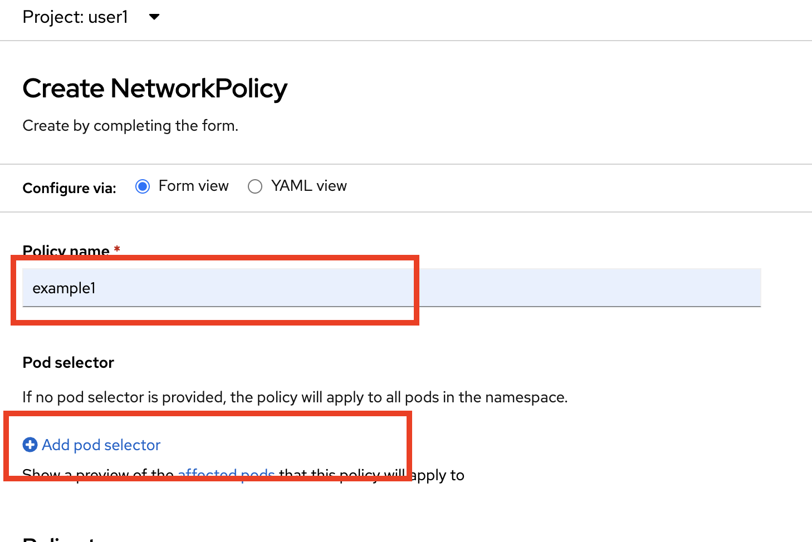

# Protect communication between applications
<!-- TOC -->

- [Protect communication between applications](#protect-communication-between-applications)
  - [Network Policy](#network-policy)
  - [Secure with mTLS (with OpenShift Service Mesh)](#secure-with-mtls-with-openshift-service-mesh)
  - [Back to Table of Content](#back-to-table-of-content)

<!-- /TOC -->


## Network Policy

scc-user1

curl -v http://backend.user1.svc.cluster.local:8080/backend

- admin
  
  
  
  
  
  
  
  
  
  
  
  
  
  
  

  
- a

## Secure with mTLS (with OpenShift Service Mesh)

  ```yaml
  apiVersion: apps/v1
  kind: Deployment
  metadata:
    name: mtls
  spec:
    selector:
      matchLabels:
        app: mtls
    template:
      metadata:
        labels:
          app: mtls
      spec:
        containers:
        - image: ubi8/ubi-minimal
          name: ubi-minimal
          command: ['sh', '-c', 'echo "Hello from user $(id -u)" && sleep infinity']
          volumeMounts:
          - mountPath: /var/opt/app/data
            name: data
        serviceAccountName: default
        volumes:
        - emptyDir: {}
          name: data
   ```

curl -v http://frontend:8080

wait admin/instructor change service mesh dataplane to mtls

## Back to Table of Content
- [Best Practices for Develop Cloud-Native Application](README.md)


