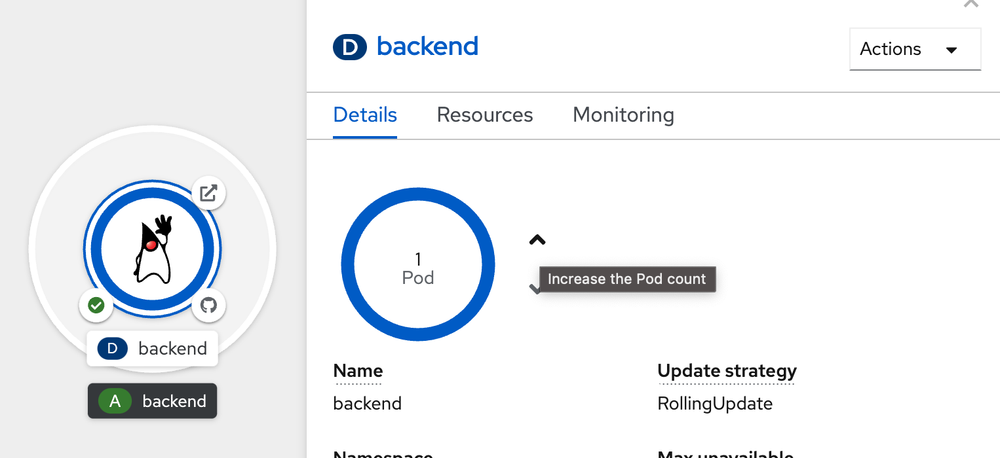
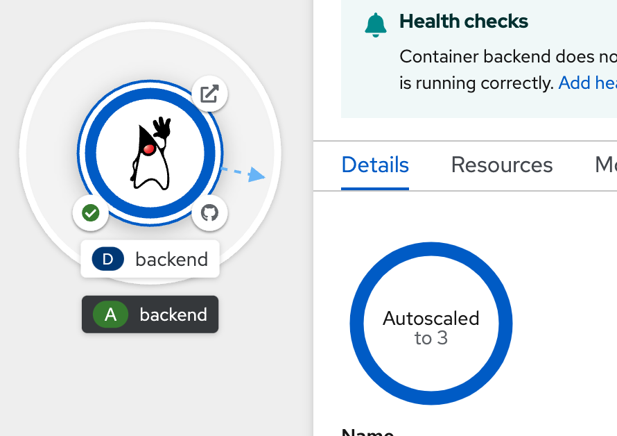

# Quality of Service (from request/limit) and Pod Auto Scaling
<!-- TOC -->

- [Quality of Service (from request/limit) and Pod Auto Scaling](#quality-of-service-from-requestlimit-and-pod-auto-scaling)
  - [Check Quality of Service](#check-quality-of-service)
  - [Use Vertical Pod Autoscaler for sizing](#use-vertical-pod-autoscaler-for-sizing)
  - [Manual Scale Application](#manual-scale-application)
  - [Auto Scale Application](#auto-scale-application)
  - [Back to Table of Content](#back-to-table-of-content)

<!-- /TOC -->
<!-- /TOC -->
- Open Web Terminal by click '>_' on top of OpenShift Web Console
- use web terminal to run command line

## Check Quality of Service

- Go to Developer Perspective, Topology view and select project <username>

  

- click Pod link in side panel
  
  
  
- click YAML Tab, see qosClass `Remember it`
  
  

- Back to Topology view click `Backend` Deployment, select Actions --> Edit resource limits

  

- Change Request Cpu = Limit Cpu, Request Memory = Limit Memory, save and wait until pod restart and complete `(Change to Running)`
  
  

- View Pod YAML again, see qosClass 
  
  
  
## Use Vertical Pod Autoscaler for sizing 

- click Import YAML icon `(Top Right of Web Console)`, create VPA, click save

  ```yaml
  apiVersion: autoscaling.k8s.io/v1
  kind: VerticalPodAutoscaler
  metadata:
  name: vpa-recommender
  spec:
  targetRef:
    apiVersion: "apps/v1"
    kind: Deployment
    name: backend
  updatePolicy:
    updateMode: "Off"
  ```

  

- go to web terminal
- run load test command

  ```bash
  BACKEND_URL=https://$(oc get route backend -o jsonpath='{.spec.host}')
  for i in {0..1000}; do
    curl $BACKEND_URL/backend
    printf "\n"
  done
  ```

- after complete, run vpa to get recommendation  `change namespace/project before run command`

  ```ssh
  oc get vpa vpa-recommender -n user1 --output yaml
  ```

  example output

  

## Manual Scale Application
- click topology in left menu, click Duke icon (backend deployment), Details tab
- click increase ther pod count (^ icon) to 2 Pod

   

- wait until application scale to 2 Pods (circle around Duke icon change to dark blue)

  

  

- Wait a few minutes, util new pod ready to receive request!!! 

- Test load to application, go to web terminal, run below command 
  ```bash
  BACKEND_URL=https://$(oc get route backend -o jsonpath='{.spec.host}')
  while [  1  ];
  do
    curl $BACKEND_URL/backend
    printf "\n"
    sleep 10
  done
  ```
  example result, check have result from 2 pods (Host value)
  ```bash
  Backend version:v1, Response:200, Host:backend-95647fbb8-kt886, Status:200, Message: Hello, World
  Backend version:v1, Response:200, Host:backend-95647fbb8-q9dqv, Status:200, Message: Hello, World
  Backend version:v1, Response:200, Host:backend-95647fbb8-kt886, Status:200, Message: Hello, World
  Backend version:v1, Response:200, Host:backend-95647fbb8-q9dqv, Status:200, Message: Hello, World
  ```

- after few minute, type 'ctrl-c' in web terminal to terminated curl command
- go to Resources Tab, in Pods section, show 2 pods after scale

  

- click 'View logs' of 1st Pod and 2nd Pod to confirm both pod are processed. 

  

  example of 1st pod

    

  example of 2nd pod

    

- back to detail pages of backend deployment, scale pod to 0 (for this case, no pod for this application)

    

    

- scale backend to 1 pod

   
   
## Auto Scale Application
- Add HorizontalPodAutoscaler
- Go to Topology, click at Duke icon for open backend deployment, click action dropdown menu, select Add HorizontalPodAutoscaler
   
- in Add HorizontalPodAutoscaler, use Form view
  - set Name: example
  - Minimum Pods: `1`
  - Maximum Pods: `3`
  - CPU Utilization: `10%`
  
   

- click save, and wait until backend deployment change to Autoscaling

   

- load test to backend application for proof auto scale
- go to web terminal
- run load test command

  ```bash
  BACKEND_URL=https://$(oc get route backend -o jsonpath='{.spec.host}')
  while [  1  ];
  do
    curl $BACKEND_URL/backend
    printf "\n"
  done
  ```

- click detail tab of backend deployment, wait until autoscaled to 3 (wait a few minutes)

     

- click resources tab, see 3 pods auto scale

  

- click Observe tab to view CPU usage 

  

- back to web terminal, input 'ctrl-c' to terminate load test command
- wait 5 minute, autoscaled will reduce pod to 1. **(if you don't want to wait autoscale down to 1 pod, you can remove HorizontalPodAutoscaler and manual scale down to 1 by yourself.)**

  

- remove HorizontalPodAutoscaler, go to backend deployment information page, select action menu, select remove HorizontalPodAutoscaler

        

- confirm Remove, and wait until backend change to manual scale

    

   

- **Optional: if you don't want to wait autoscale down to 1 pod, you can remove HorizontalPodAutoscaler and manual scale down to 1 by yourself.**
  
## Back to Table of Content
- [Best Practices for Develop Cloud-Native Application](README.md)


