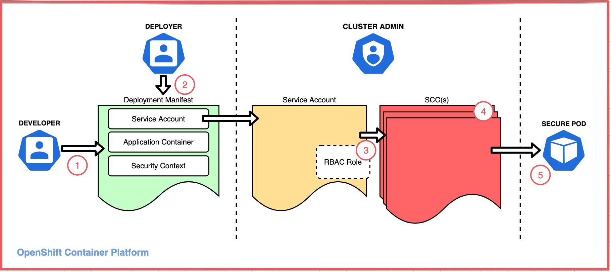
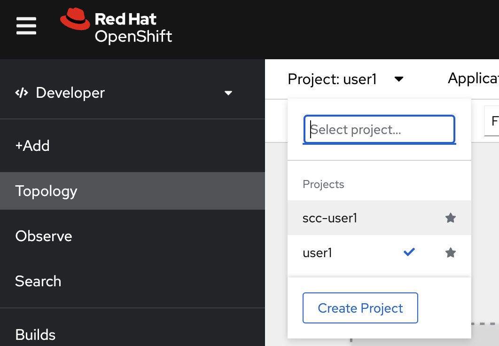
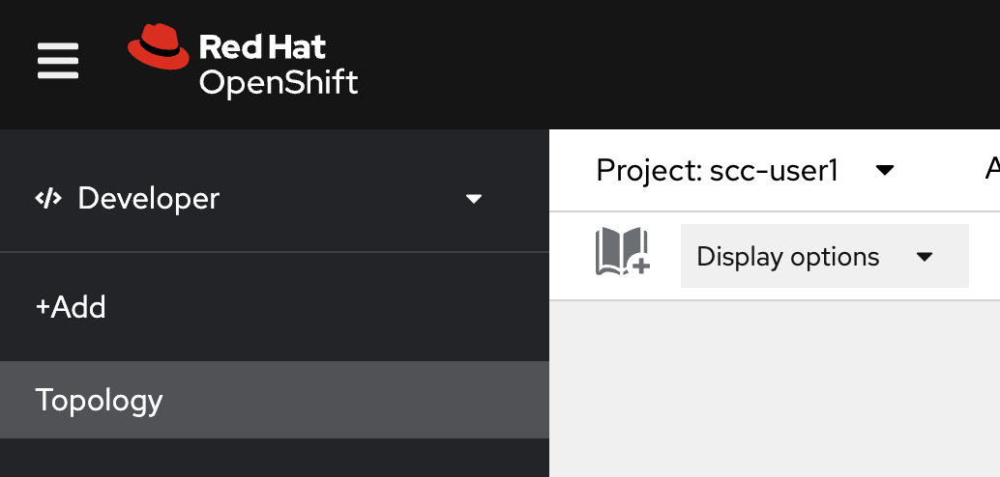

# Use SCCs to control permissions for pods
<!-- TOC -->

- [Use SCCs to control permissions for pods](#use-sccs-to-control-permissions-for-pods)
  - [Security context constraints concepts](#security-context-constraints-concepts)
  - [Create Default Deployment](#create-default-deployment)
  - [Back to Table of Content](#back-to-table-of-content)

<!-- /TOC -->
## Security context constraints concepts

Before attempting this hands-on tutorial, you should understand how SCCs are used. The article ["Overview of security context constraints"](https://developer.ibm.com/learningpaths/secure-context-constraints-openshift/intro/) explains these overall concepts, which are summarized as follows.

An application's access to protected functions is an agreement between three personas:

- A `developer` who writes an application that accesses protected functions
- A `deployer` who writes the deployment manifest that must request the access the application requires
- An `administrator` who decides whether to grant the deployment the access it requests

This diagram illustrates the components and process that allow an application to access resources:

1. A developer writes an application that needs access to protected functions
2. A deployer creates a deployment manifest to deploy the application with a pod spec that configures:
    - A security context (SC) (for the pod and/or for each container) that requests the access needed by the application, thereby requesting it
    - A service account to grant the requested access
3. An administrator assigns a security context constraint (SCC) to the service account that grants the requested access. The SCC can be assigned directly to the service account or indirectly via an RBAC role or group.
4. The SCC may be one of OpenShift's predefined SCCs or it may be a custom SCC.
5. If the SCC grants the access, the admission process allows the pod to deploy and the pod configures the container as specified.

Starting from OpenShift v4.11, more default SCCs are defined to align with the Kubernetes pod security standards. Even the default SCC for the default service account is changed. If you're using OpenShift v4.11 or later, parts of the outputs provided in this tutorial could be different from yours. In most cases, the possible discrepancies are mentioned for your awareness.

`Note`: An OpenShift service account is a special type of user account that is used programmatically without using a regular user’s credentials.

## Create Default Deployment

- In OpenShift Console, Developer Perspective, Select project `scc-<username>` such as `scc-user1` --> change <username> to your username

  

  

- 
oc project scc-user1

oc get pod -l app=scc-tutorial-default -o yaml

 apiVersion: apps/v1
 kind: Deployment
 metadata:
   name: scc-tutorial-deploy-sc-sa
 spec:
   selector:
     matchLabels:
       app: scc-tutorial-sc-sa
   template:
     metadata:
       labels:
         app: scc-tutorial-sc-sa
     spec:
       containers:
       - image: ubi8/ubi-minimal
         name: ubi-minimal
         command: ['sh', '-c', 'echo "Hello from user $(id -u)" && sleep infinity']
         securityContext:
           runAsUser: 1234
           runAsGroup: 5678
         volumeMounts:
         - mountPath: /var/opt/app/data
           name: data
       serviceAccount: anyuid
       serviceAccountName: anyuid
       securityContext:
         fsGroup: 5555
         supplementalGroups: [5777, 5888]
       volumes:
       - emptyDir: {}
         name: data

## Back to Table of Content
- [Best Practices for Develop Cloud-Native Application](README.md)

