# Use SCCs to control permissions for pods
<!-- TOC -->

- [Use SCCs to control permissions for pods](#use-sccs-to-control-permissions-for-pods)
  - [Security context constraints concepts](#security-context-constraints-concepts)
  - [Create Default Deployment](#create-default-deployment)
  - [Examine the default SCs and SCC](#examine-the-default-scs-and-scc)
  - [Test your container's runtime permissions](#test-your-containers-runtime-permissions)
  - [Attempt a deployment with SCs](#attempt-a-deployment-with-scs)
  - [Create and assign an SCC `(Admin Task, already in this lab)`](#create-and-assign-an-scc-admin-task-already-in-this-lab)
  - [Create a deployment using the service account that can use the SCC](#create-a-deployment-using-the-service-account-that-can-use-the-scc)
  - [Examine after adding custom SCs and SCC](#examine-after-adding-custom-scs-and-scc)
  - [Test your container's runtime permissions](#test-your-containers-runtime-permissions-1)
  - [Back to Table of Content](#back-to-table-of-content)

<!-- /TOC -->
  - [Examine after adding custom SCs and SCC](#examine-after-adding-custom-scs-and-scc)
  - [Test your container's runtime permissions](#test-your-containers-runtime-permissions-1)
  - [Back to Table of Content](#back-to-table-of-content)

<!-- /TOC -->
## Security context constraints concepts

Before attempting this hands-on tutorial, you should understand how SCCs are used. The article ["Overview of security context constraints"](https://developer.ibm.com/learningpaths/secure-context-constraints-openshift/intro/) explains these overall concepts, which are summarized as follows.

An application's access to protected functions is an agreement between three personas:

- A `developer` who writes an application that accesses protected functions
- A `deployer` who writes the deployment manifest that must request the access the application requires
- An `administrator` who decides whether to grant the deployment the access it requests

This diagram illustrates the components and process that allow an application to access resources:


1. A developer writes an application that needs access to protected functions
2. A deployer creates a deployment manifest to deploy the application with a pod spec that configures:
    - A security context (SC) (for the pod and/or for each container) that requests the access needed by the application, thereby requesting it
    - A service account to grant the requested access
3. An administrator assigns a security context constraint (SCC) to the service account that grants the requested access. The SCC can be assigned directly to the service account or indirectly via an RBAC role or group.
4. The SCC may be one of OpenShift's predefined SCCs or it may be a custom SCC.
5. If the SCC grants the access, the admission process allows the pod to deploy and the pod configures the container as specified.

Starting from OpenShift v4.11, more default SCCs are defined to align with the Kubernetes pod security standards. Even the default SCC for the default service account is changed. If you're using OpenShift v4.11 or later, parts of the outputs provided in this tutorial could be different from yours. In most cases, the possible discrepancies are mentioned for your awareness.

`Note`: An OpenShift service account is a special type of user account that is used programmatically without using a regular user’s credentials.

## Create Default Deployment

- In OpenShift Console, Developer Perspective, Select project `scc-<username>` such as `scc-user1` --> change <username> to your username

  

  

- deploy application using a base image, click import yaml icon (see below)

  

- input yaml in Import Yaml, review and click create
  
  ```yaml
  apiVersion: apps/v1
  kind: Deployment
  metadata:
    name: scc-tutorial-deploy-default
  spec:
    selector:
      matchLabels:
        app: scc-tutorial-default
    template:
      metadata:
        labels:
          app: scc-tutorial-default
      spec:
        containers:
        - image: ubi8/ubi-minimal
          name: ubi-minimal
          command: ['sh', '-c', 'echo "Hello from user $(id -u)" && sleep infinity']
          volumeMounts:
          - mountPath: /var/opt/app/data
            name: data
        serviceAccountName: default
        volumes:
        - emptyDir: {}
          name: data
   ```

  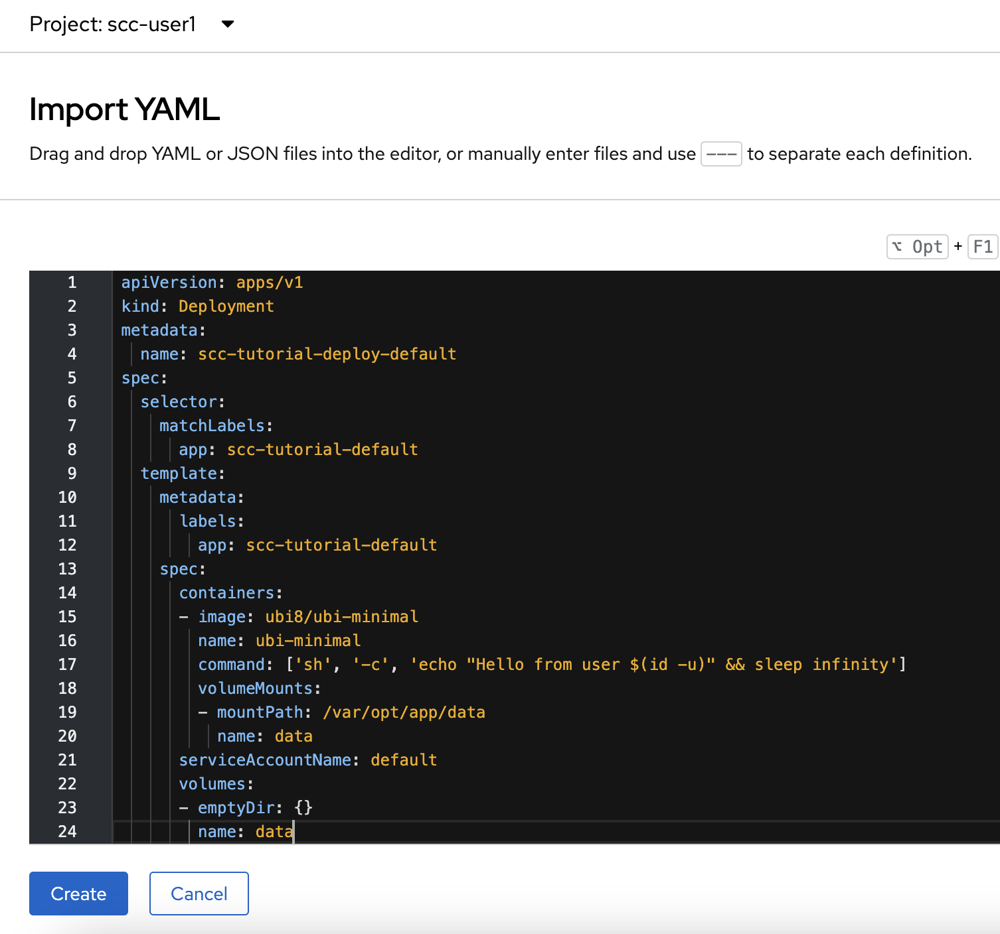

  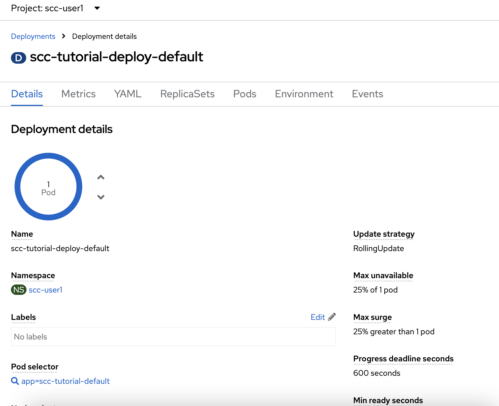

- back to Topology view
  
  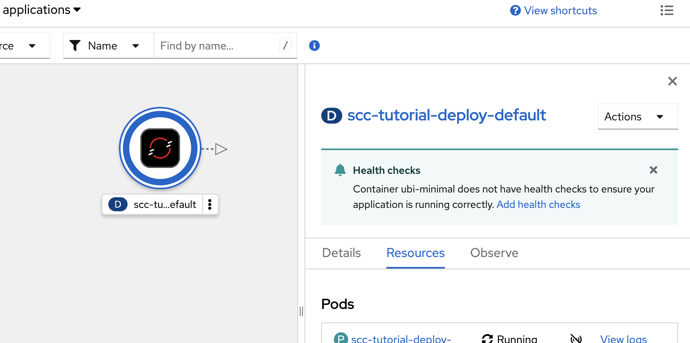

## Examine the default SCs and SCC

  You can get the full YAML description of the pod to see the details. For this tutorial, the interesting part is the annotation that shows which SCC was used, the container's SC, and the pod's SC. In this example, our manifest explicitly specifies the default service account for completeness, a setting that's usually left implied.

  You can use the OpenShift Web Console or use the oc command-line interface in your terminal to see the results.

- Click Web Terminal icon and wait until terminal ready to use.

  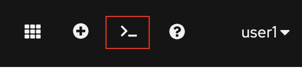

  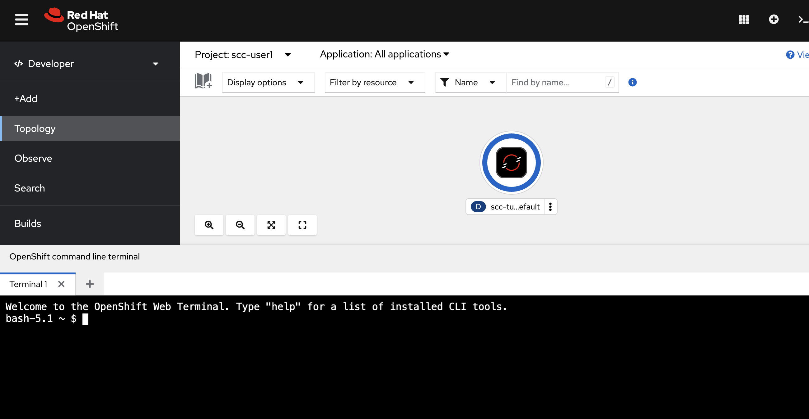

- using command line to view default scc `(change project name to your scc-<username>)`
  
  ```ssh
  oc project scc-<username>
  oc get pod -l app=scc-tutorial-default -o yaml
  ```

  example output

  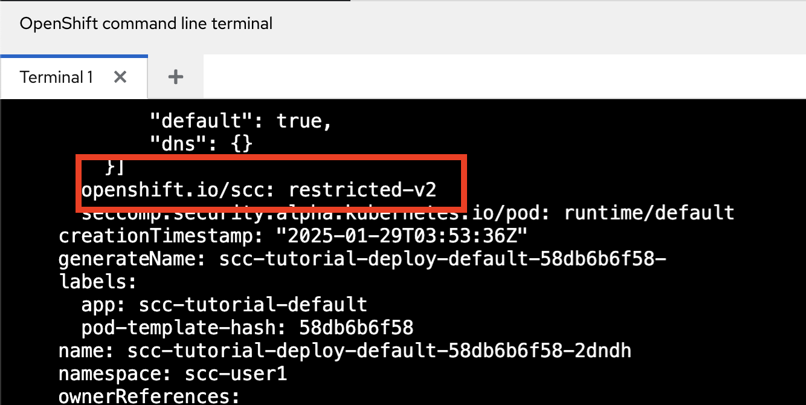

- using openshift web console to view default scc
- Use the sidebar pull-down menu to select Administrator, Expand Workloads, Select Deployments, Status should say "1 of 1 pods."

  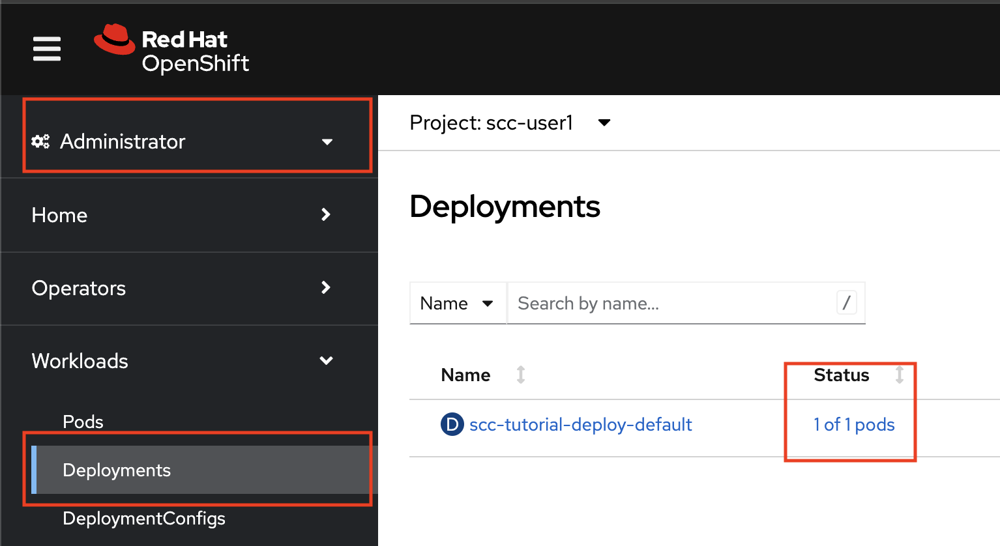

- Check the details of your pod, Click the deployment status "1 of 1 pods" link, Click the pod name `scc-tutorial-deploy-default-<generated-suffix>`, Select the YAML tab.

  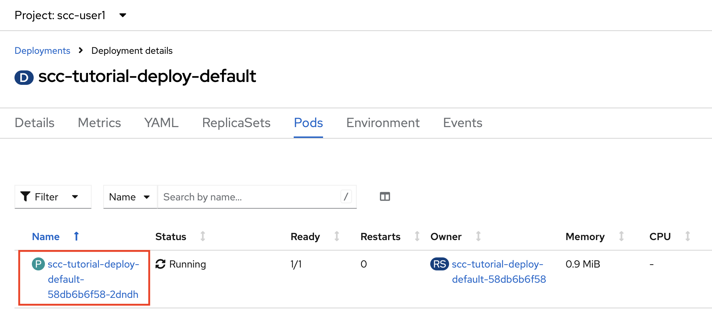

- The pod YAML shows the SCC that was assigned.The SCC is shown in annotations.The default deployment got the restricted or restricted-v2 SCC depends on the OpenShift version you are using. This was the highest priority and most restrictive SCC available to the service account.

  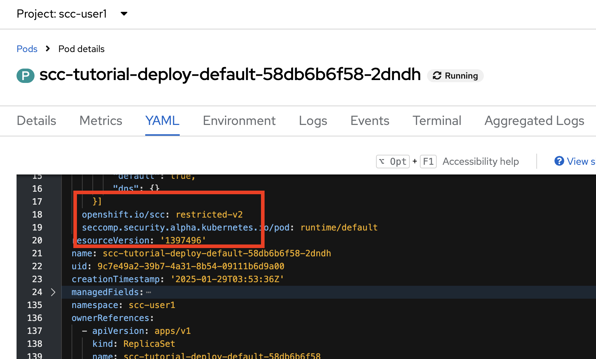

- Scroll down to see the service account, pod SC, and container SC. serviceAccountName is default. You will change this later. securityContext for the pod was given seLinuxOptions and an fsGroup setting. These came from the project defaults. securityContext for the container was given some specific capabilities to drop and a runAsUser. These are also from the project defaults. Notice that the container's runAsUser is the same as the pod's fsGroup. Furthermore, all capabilities are dropped and seccompProfile is set to RuntimeDefault in OpenShift v4.11 and later.

  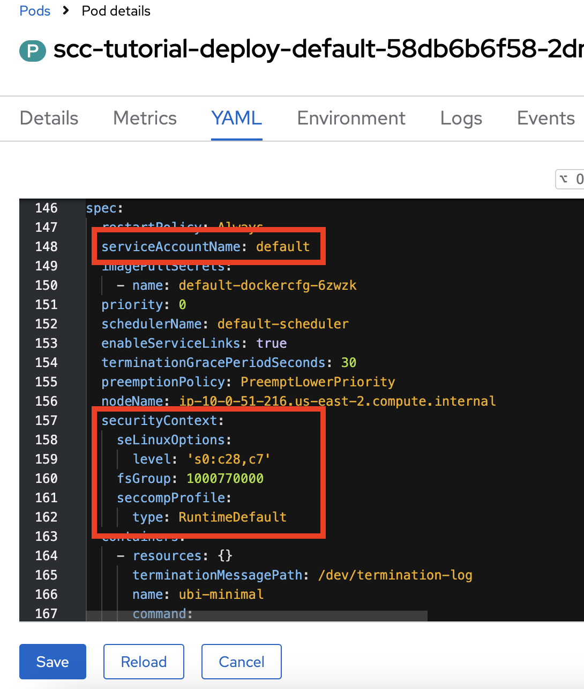

  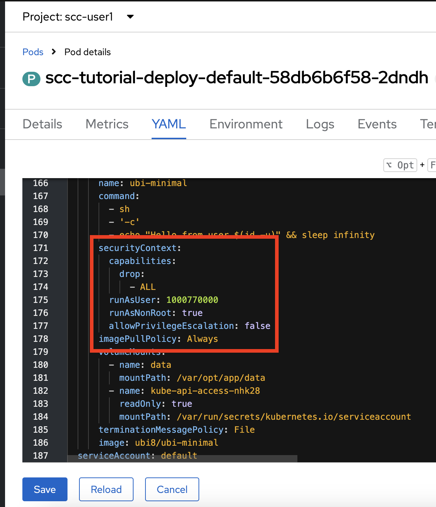

## Test your container's runtime permissions

- Use the OpenShift Web Console or use the oc command-line interface in your terminal to see the results.
  
  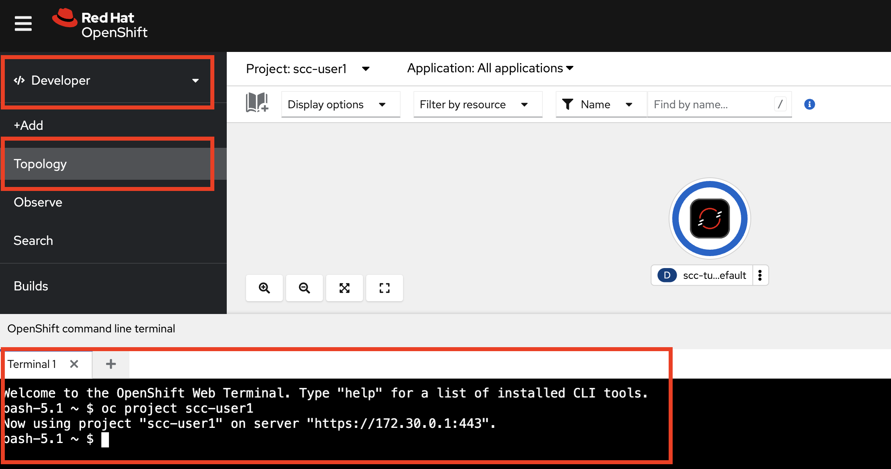

- get pod name `(change project name to your scc-<username>)`
  
  ```ssh
  oc project scc-<username>
  oc get pod -l app=scc-tutorial-default
  ```

- remote shell into the pod's container

  ```ssh
  oc rsh <pod-name>
  ```

- or using the openshift web console, Select the Terminal tab on the pod details page:

  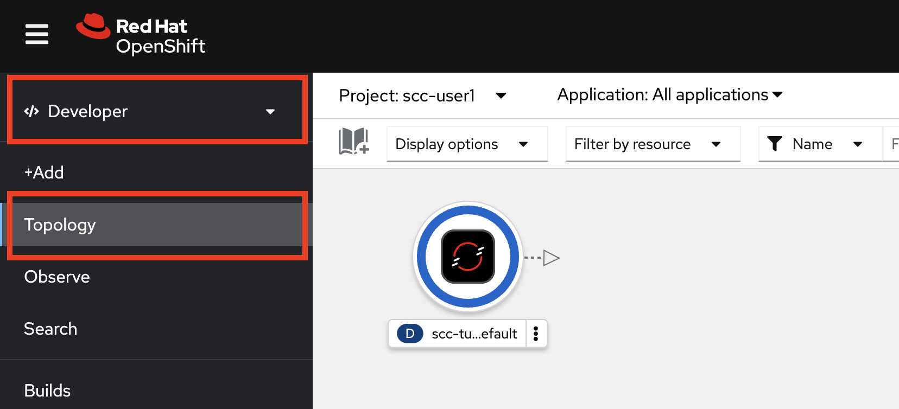

  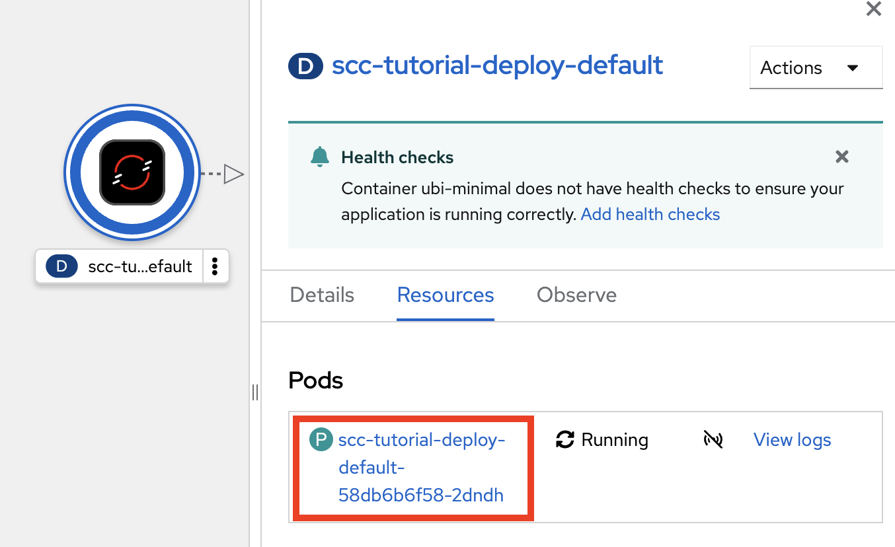

  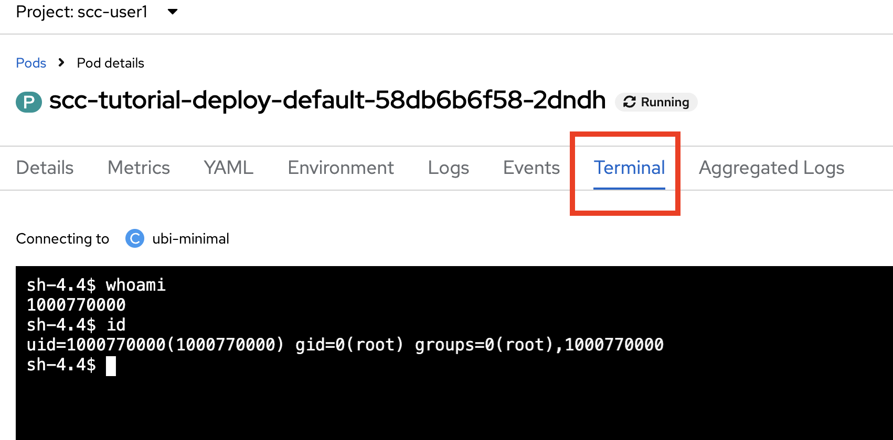

- Check the user ID and group memberships:
  
  ```ssh
  whoami
  id
  ```

- With the restricted or restricted-v2 SCC, you got the user ID and group IDs from the project defaults. Remember, you did not specify any user ID or group ID in your deployment manifest. The user ID is the one that you saw assigned in the container securityContext.runAsUser. This user ID is assigned to the root group (ID 0) as its default group ID. The user is also a member of the file system group. In this case, the file system group is the same as the user ID. This is assigned in the pod securityContext.fsGroup.

- run below command, see what happens when you write a file
  
  ```ssh
  ls -ld / /tmp /var/opt/app/data
  echo hello > /var/opt/app/data/volume.txt	
  echo hello > /tmp/temp.txt	
  echo hello > /fail.txt	
  ls -l /tmp/temp.txt /var/opt/app/data/volume.txt
  ```

  example output

  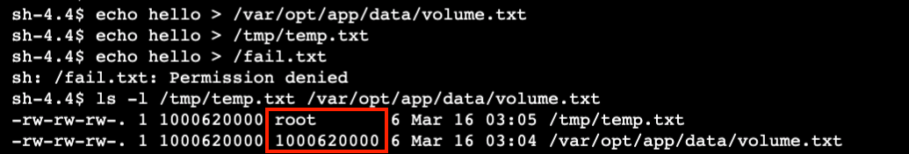

- What does this show?
  
  The file that you wrote on the volume is owned by your user ID and file system group ID (because of the sticky bit). This is really significant. In the next step, you choose the group that you want to share files with (instead of this default ID). The file that you wrote in the temporary directory is owned by your user ID and your default group ID (root). You use this local file behavior to highlight the effect of the file system group on your mounted volume. You don't have write permission in the root directory. This emphasizes that you are not running as root or as a privileged user. Now that you know how to avoid running as root, it's time to choose your user or group IDs.

## Attempt a deployment with SCs

  This step shows a scenario where you are deploying an application that needs a specific user ID and also requires a shared group ID for data access. This example covers the use cases mentioned earlier.

  First, use SCs in your deployment manifest to specify the expected user ID and group IDs for your pod and container.

  These SCs are validated against SCCs that are assigned to the service account. If there is not an SCC that can validate the SCs, then the pod will not start.

- Request special permissions for your deployment, We added SCs for the pod and the container to request the following settings for access control:

  - Run as user ID 1234.
  - Run as group ID 5678.
  - Add supplemental group IDs 5777 and 5888.
  - Use a file system group ID of 5555.

- Deploy new image with specail permission with Import YAML

  ```yaml
  apiVersion: apps/v1
  kind: Deployment
  metadata:
    name: scc-tutorial-deploy-sc
  spec:
    selector:
      matchLabels:
        app: scc-tutorial-sc
    template:
      metadata:
        labels:
          app: scc-tutorial-sc
      spec:
        containers:
        - image: ubi8/ubi-minimal
          name: ubi-minimal
          command: ['sh', '-c', 'echo "Hello from user $(id -u)" && sleep infinity']
          securityContext:
            runAsUser: 1234
            runAsGroup: 5678
          volumeMounts:
          - mountPath: /var/opt/app/data
            name: data
        serviceAccountName: default
        securityContext:
          fsGroup: 5555
          supplementalGroups: [5777, 5888]
        volumes:
        - emptyDir: {}
          name: data
  ```

  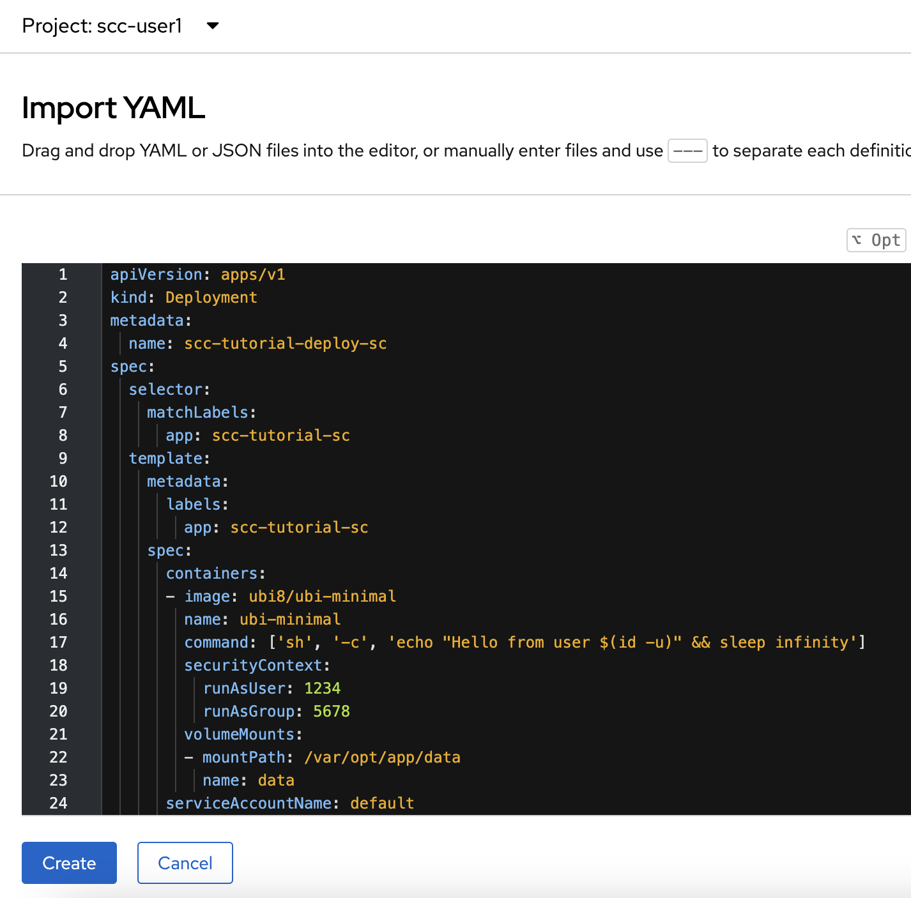

- openshift show error about deployment
  
  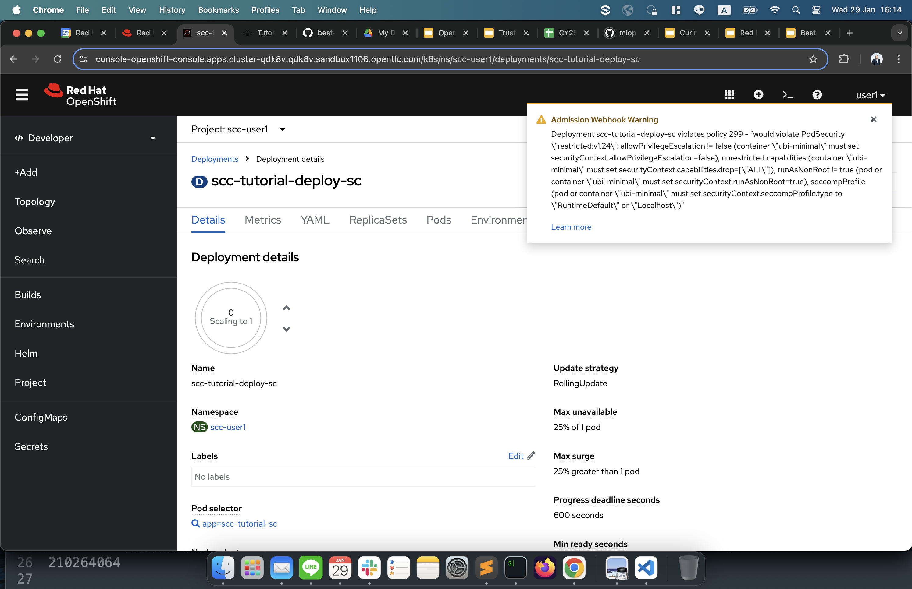

- scroll down to view ReplicaFailure in Conditions

  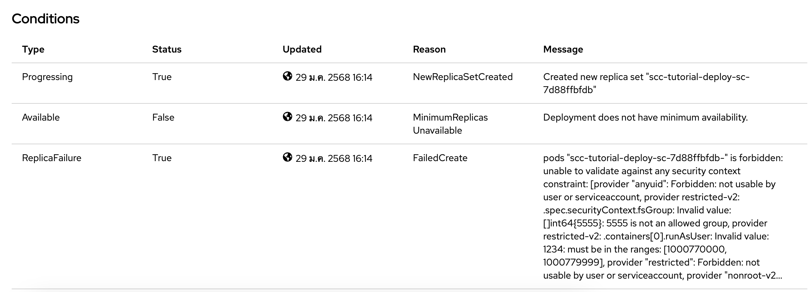

- When a deployment fails due to SCC, you need to check the status of the replica set. Describe the deployment to check replica status:

  ```ssh
   oc describe deployment/scc-tutorial-deploy-sc
  ```

  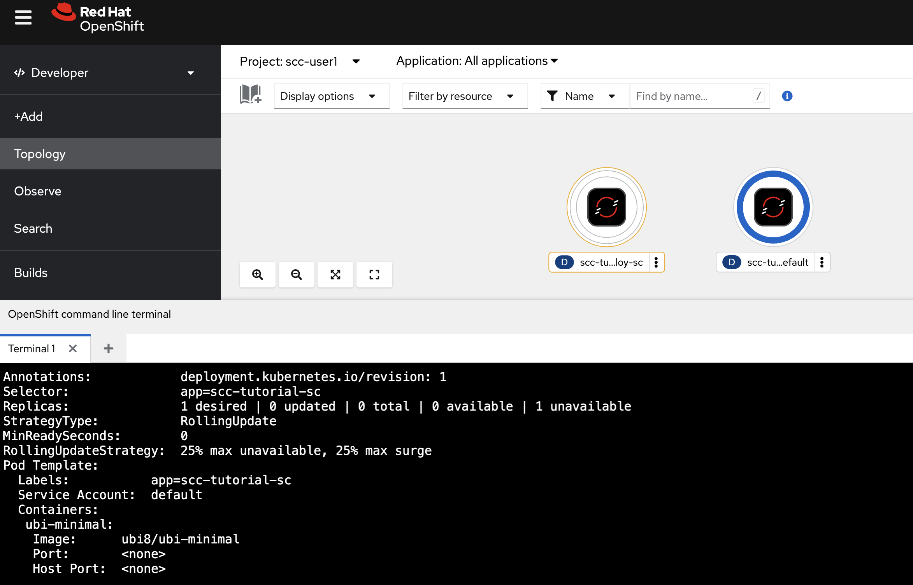

- To get a more specific reason for the replica set failure, use oc get events:

  ```ssh
  oc get events | grep replicaset/scc-tutorial-deploy-sc
  ```

- If you are using OpenShift v4.11 or later, the outputs contain a list of SCCs that were used to validate the SC in the deployment and failed. The FailedCreate warning clearly shows that you have been unable to validate against any security context constraints due to the fsGroup and runAsUser values.

  This error is expected because the deployment manifest has asked for specific permissions, and the default service account cannot use any SCC that allows these permissions. This tells you that either the deployer has requested too much access in the manifest or the cluster admin needs to provide an SCC that allows more access.

  It might look like the deployment hasn't deployed, but that's not the problem. A deployment named scc-tutorial-deploy-sc has been created. You can use either oc get deployment or the OpenShift Web Console to look for it. A replica set named scc-tutorial-deploy-sc-<generated-suffix> has also been created -- but both show 0-of-1 pods have been created, and the replica set has an event that explains the problem.

  So, instead of deploying an application that will eventually run into data access errors, you make it fail earlier with error messages that explain why. Failing early is definitely a good thing. By clearly indicating the special permissions needed by this application, the developer, the deployer, and the security administrator are better able to communicate the special security requirements of this deployment.

## Create and assign an SCC `(Admin Task, already in this lab)`

- create service account `(already in this lab)` , example only

  ```ssh
   oc create sa anyuid -n scc-user1
  ```

- add scc's `anyuid` to service account `anyuid` in project `(already in this lab)` , example only
  
  ```ssh
  oc adm policy add-scc-to-user -n scc-user1 -z anyuid anyuid
  ```

- check service account `anyuid` , go to search menu, filter with ServiceAccount

  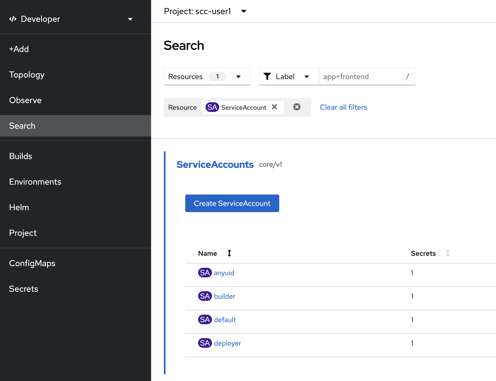 

- check service account `anyuid` rolebinding, go to search menu, filter with RoleBinding, view Subject kind ServiceAccount `anyuid`

  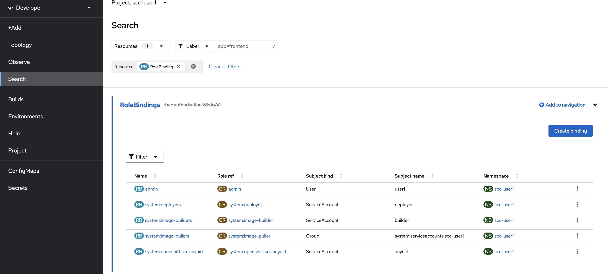

## Create a deployment using the service account that can use the SCC

- Deploy base image with new service account with scc's `anyuid`                          

  ```yaml
  apiVersion: apps/v1
  kind: Deployment
  metadata:
    name: scc-tutorial-deploy-sc-sa
  spec:
    selector:
      matchLabels:
        app: scc-tutorial-sc-sa
    template:
      metadata:
        labels:
          app: scc-tutorial-sc-sa
      spec:
        containers:
        - image: ubi8/ubi-minimal
          name: ubi-minimal
          command: ['sh', '-c', 'echo "Hello from user $(id -u)" && sleep infinity']
          securityContext:
            runAsUser: 1234
            runAsGroup: 5678
          volumeMounts:
          - mountPath: /var/opt/app/data
            name: data
        serviceAccount: anyuid
        serviceAccountName: anyuid
        securityContext:
          fsGroup: 5555
          supplementalGroups: [5777, 5888]
        volumes:
        - emptyDir: {}
          name: data
  ```

- check deployment success!!!

  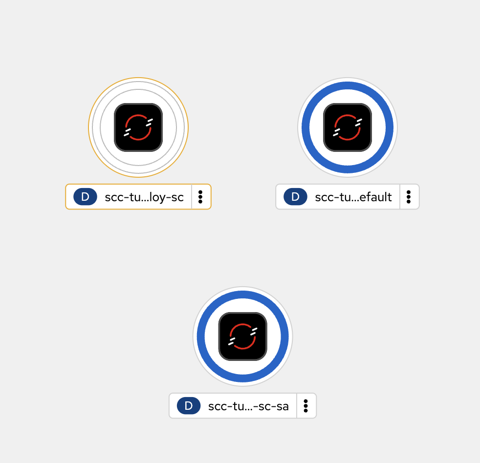

## Examine after adding custom SCs and SCC

- To get the details for the pod, use oc get with the label app=scc-tutorial-sc-sa and the yaml output option:
  
  ```ssh
  oc get pod -l app=scc-tutorial-sc-sa -o yaml
  ```

  example output

  ```ssh
    ...
    metadata:
      annotations:
        ...
        openshift.io/scc: anyuid
        ...
    spec:
      containers:
        ...
        securityContext:
          runAsGroup: 5678
          runAsUser: 1234
          ...
        volumeMounts:
        - mountPath: /var/opt/app/data
        ...
      securityContext:
        fsGroup: 5555
        supplementalGroups:
        - 5777
        - 5888
      serviceAccount: anyuid
      serviceAccountName: anyuid
    ...
  ```

- try to using web console check scc

- The pod YAML shows the SCC that was assigned.

  - The SCC is shown in annotations.
  - This deployment used the new `anyuid` SCC. This was the highest priority, most restrictive SCC that was able to validate your SCs (and was available to your service account).

- Scroll down to see the pod spec. Instead of defaults, you'll see that the manifest has determined the SCs:

  - SecurityContext for the pod was given fsGroup: 5555 and supplementalGroups: [5777, 5888].
  - SecurityContext for the container was given runAsUser: 1234 and runAsGroup: 5678. If your cluster is OpenShift v4.11 or later, the runAsNonRoot is set as true.
  - The volume was mounted at /var/opt/app/data.

## Test your container's runtime permissions

- Select the Web Terminal tab on the pod details page. (of `scc-tutorial-sc-sa`)

- get pod name
  
  ```ssh
  oc get pod -l app=scc-tutorial-sc-sa
  ```

- remote shell into the pod's container:

  ```ssh
  oc rsh <pod-name>
  ```

- Check the user ID and group memberships
  
  ```ssh
  whoami
  id
  ```

- To see how the file system group was used for your volume, use this command:
  
  ```ssh
  ls -ld / /tmp /var/opt/app/data
  echo hello > /var/opt/app/data/volume.txt
  echo hello > /tmp/temp.txt
  echo hello > /fail.txt
  ls -l /tmp/temp.txt /var/opt/app/data/volume.txt
  ```

- What does this show?

    - In /tmp, the file you created is owned by 1234/5678 (your specified uid/gid instead of a project default like 1000620000/root).
    - On the volume, the file you created is owned by 1234/5555 (your specified uid/fsGroup instead of a project default like 1000620000/1000620000).
    - You didn't run as root or use the root group.
    - If the volume was shared storage, containers with different user IDs would be able to share data with members of the same group.
    - This example only used the fsGroup, but you can see that the other supplemental groups that you specified have also been created and assigned to the user.

    Of particular interest in these examples is the behavior of the file system group (fsGroup). This special group is used for mounting volumes. When a file system is backed by storage that supports fsGroup, the directory permissions are set so that files created in this directory are owned by the group. This allows file sharing for containers that run as different users in the same group (for example, 2 containers in 1 pod or multiple pod instances using persistent volumes). For other directories or other types of storage, the supplemental groups can be used similarly by setting the desired supplemental group as a directory or file owner.

## Back to Table of Content
- [Best Practices for Develop Cloud-Native Application](README.md)


