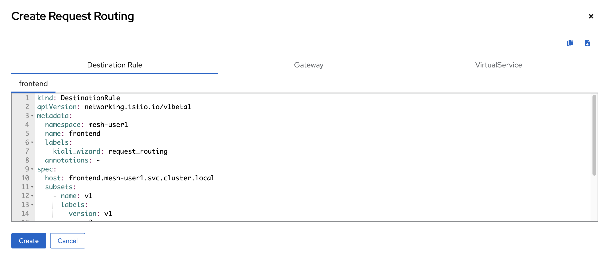

# Implement Application Resiliency
<!-- TOC -->

- [Implement Application Resiliency](#implement-application-resiliency)
  - [Current Topology](#current-topology)
  - [Tranffic Mangement with OSSM](#tranffic-mangement-with-ossm)
  - [Test Mesh](#test-mesh)
  - [Observability with OSSM](#observability-with-ossm)
  - [Back to Table of Content](#back-to-table-of-content)

<!-- /TOC -->
## Current Topology

- Review Deployment of Control Plane in Project `istio-system`

  

- Project `mesh-userX` add to manage by OSSM (OpenShift Service Mesh, by Instructor :D), for more information
  - [OpenShift Service Mesh](https://docs.openshift.com/container-platform/4.16/service_mesh/v2x/ossm-architecture.html)
  - [Istio](https://istio.io/)
  - [Kiali](https://kiali.io/)
  - [Jaeger](https://www.jaegertracing.io/)

- In Developer Console change to Project mesh-userX `(change X to your username!!!)`
  
  

- Review Pod in project `mesh-userX`, click Project in Left Menu, Overview Tab, In Inventory, click `4 Pods` link.
    
  

- In Pods, attribute Ready show have 2 container in each pod. why???

  

- click link from one of the displayed pods, in Details tab, scroll down to Containers section, view containers in this pod.
  
  
  
  

- What is istio-proxy?

  - OpenShift Service Mesh Architecture.
    
    service mesh is logically split into a data plane and a control plane.

    The data plane is composed of a set of intelligent proxies (Envoy) deployed as sidecars. These proxies mediate and control all network communication between microservices. They also collect and report telemetry on all mesh traffic.

    The control plane manages and configures the proxies to route traffic.

    The following diagram shows the different components that make up each plane:

    

  - OSSM Components
    
    The following sections provide a brief overview of each of Istio’s core components.

    - Envoy
      
      OSSM uses an extended version of the Envoy proxy. Envoy is a high-performance proxy developed in C++ to mediate all inbound and outbound traffic for all services in the service mesh. Envoy proxies are the only Istio components that interact with data plane traffic.

      Envoy proxies are deployed as sidecars to services, logically augmenting the services with Envoy’s many built-in features, for example:

      - Dynamic service discovery
      - Load balancing
      - TLS termination
      - HTTP/2 and gRPC proxies
      - Circuit breakers
      - Health checks
      - Staged rollouts with %-based traffic split
      - Fault injection
      - Rich metrics

      This sidecar deployment allows Istio to enforce policy decisions and extract rich telemetry which can be sent to monitoring systems to provide information about the behavior of the entire mesh.

      The sidecar proxy model also allows you to add Istio capabilities to an existing deployment without requiring you to rearchitect or rewrite code.

      Some of the Istio features and tasks enabled by Envoy proxies include:

      - Traffic control features: enforce fine-grained traffic control with rich routing rules for HTTP, gRPC, WebSocket, and TCP traffic.

      - Network resiliency features: setup retries, failovers, circuit breakers, and fault injection.

      - Security and authentication features: enforce security policies and enforce access control and rate limiting defined through the configuration API.

      - Pluggable extensions model based on WebAssembly that allows for custom policy enforcement and telemetry generation for mesh traffic.

    - Istiod

      Istiod provides service discovery, configuration and certificate management.

      Istiod converts high level routing rules that control traffic behavior into Envoy-specific configurations, and propagates them to the sidecars at runtime. It abstracts platform-specific service discovery mechanisms and synthesizes them into a standard format that any sidecar conforming with the Envoy API can consume.

      Istio can support discovery for multiple environments such as Kubernetes or VMs.

      You can use Istio’s Traffic Management API to instruct Istiod to refine the Envoy configuration to exercise more granular control over the traffic in your service mesh.

      Istiod security enables strong service-to-service and end-user authentication with built-in identity and credential management. You can use Istio to upgrade unencrypted traffic in the service mesh. Using Istio, operators can enforce policies based on service identity rather than on relatively unstable layer 3 or layer 4 network identifiers. Additionally, you can use Istio’s authorization feature to control who can access your services.

      Istiod acts as a Certificate Authority (CA) and generates certificates to allow secure mTLS communication in the data plane.

- How to inject sidecar? click frontend-v2, click Deployment link `(D) frontend-v2`
      
  

- In YAML tab, scroll down to spec: --> template: --> annotations: --> `sidecar.istio.io/inject: 'true'`

  

- more information to enabling sidecar injection --> [`Enabling sidecar injection`](https://docs.openshift.com/container-platform/4.16/service_mesh/v2x/prepare-to-deploy-applications-ossm.html)

## Tranffic Mangement with OSSM

- Example Traffic Management with OSSM
  
  

- What is [Destination Rule](https://docs.openshift.com/container-platform/4.16/service_mesh/v2x/ossm-traffic-manage.html#ossm-routing-destination-rules_traffic-management), [Virtual Service](https://docs.openshift.com/container-platform/4.16/service_mesh/v2x/ossm-traffic-manage.html#ossm-routing-virtual-services_traffic-management) and [Gateway?](https://docs.openshift.com/container-platform/4.16/service_mesh/v2x/ossm-traffic-manage.html#ossm-gateways_traffic-management)

- Get Domain Name information, open web terminal, and run command to get Domain, save value in your notepad or another text editor, we will use this value in next step!!!

  ```ssh
  oc project mesh-userX
  DOMAIN=$(oc whoami --show-console|awk -F'apps.' '{print $2}')
  echo $DOMAIN
  ```

  example result

  

- Create Traffic Management with Kiali, Click Kiali Link on top left in `mesh-userX` Project

  

- Click Services (left menu), frontend, and click Actions --> Request Routing
  
  

  
  
- In Create Request Routing, select `Route To` tab, set traffic to `frontend-v1` 50%, to `frontend-v2` 50%, 
- click Add Route Rule,
- click show Advanced Options  
 
  

- In Destination Hosts Tab, 
  - input VirtualService Host with `mesh-userX-frontend.apps.DOMAIN`, 
  - replace userX with your username, 
  - replace DOMAIN with previous value from terminal.  
    
  

- In Gateway tab, 
  - click Add Gateway,
  - select Create Gateway,
  - port : `80`,
  - Gateway Hosts : `mesh-userX-frontend.apps.DOMAIN`, replace userX with your username, replace DOMAIN with previous value from terminal.  
  - leave other default

  

- In Traffic Policy tab,
  - TLS : `UNSET`
  - Add LoadBalancer : select `simple`
  - LoadBalancer : `ROUND_ROBIN`
  
  

- click Preview, review Destination Rule, Gateway and VirtualService, Click Create
  
  
  
  
  
  

  

- Click Services, check `frontend` service have Gateway, VirtualService and DestinationRule.

  

## Test Mesh

- Back to OpenShift Console, Open Web Terminal to test call mesh (Change X to your username!!!)

- check route
  
  ```ssh
  oc project mesh-userX
  oc get route -n istio-system | grep mesh-userX-frontend-gateway
  ```

- test call mesh  (Change X to your username!!!)
  
  ```ssh
  FRONTEND_ISTIO_ROUTE=$(oc get route -n istio-system|grep mesh-userX-frontend-gateway |awk '{print $2}')
  curl http://$FRONTEND_ISTIO_ROUTE
  ```

  example result

  
  
## Observability with OSSM

- run workload to mesh, open web terminal and run workload to mesh (Change X to your username!!!)

  ```ssh
  FRONTEND_ISTIO_ROUTE=$(oc get route -n istio-system|grep mesh-user2-frontend-gateway |awk '{print $2}')
  while [ 1 ];
  do
      curl -s $FRONTEND_ISTIO_ROUTE
      printf "%s\n"
      sleep 1
  done
  ```

- open kiali, select menu Graph
  - namespace: `mesh-userX`, change X to your username
  - Display : Traffic Distribution, Traffic Animation, Leave other default
  
  

- Review Applications, click Application Menu (left menu), frontend, Overview
  
  

- click Traffic Tab, to view traffic
  
  

- click Inbound Metrics tab
  
  

- click Outbound Metrics tab
  
  

- click Traces tab
  
  

- In Traces tab, click view in tracing link, for first time, click Log in with OpenShift
  
  

- Allow permission (first time only!)
  
  

- View Tracing in Jaeger
  
  
  
  

- `Stop workload in Web Terminal by Ctrl+C !!!`

<!--


## Test Service without Change Code `(Chaos engineering !!!)`

- `Stop workload in Web Terminal by Ctrl+C !!!` if you forgot it.

- Set all request to `backend v1`, in kiali, select Services, `backend`, 
  
  
  
- click Actions, click Delete Traffic Routing

  

- after confirm delete previus traffic routing, click actions again and select request routing to create new!
  
  

- go to Route To tab, set traffic weight to backend-v1 100%, click Add Route Rule, click Preview and Create

  

- run workload to mesh agian,
  ```ssh
  while [ 1 ];
  do
        OUTPUT=$(curl -s $FRONTEND_ISTIO_ROUTE)
        printf "%s\n" $OUTPUT
        sleep 1
  done
  ```

- check all request send to Backend version:v1 !!!

  

- exit workload to mesh by Ctrl+C
- test response time of mesh by curl
  
  ```ssh
  curl -kv -w '\n* Response time: %{time_total}s\n' http://$FRONTEND_ISTIO_ROUTE
  ```

- try to add slow connection for test timeout at client, we will add 5 seconds delay at 50% of request to frontend!!!
- In kiali, Services, frontend, edit Request Routing
- Click Remove Rule for current Route Rules,

  

- change to Fault Injection,
  - add HTTP Delay,
  - set 50 Delay Percentage
  - Fixed Delay 5s
  - click Add Route Rule
  - Click Preview, Update

  
  
  

- test response time of mesh by curl again, 
  
  ```ssh
  curl -kv -w '\n* Response time: %{time_total}s\n' http://$FRONTEND_ISTIO_ROUTE
  ```

- try to add HTTP Abort/Service Not Available for test at client, we will add http abort 503 at 50% of request to frontend!!!
- In kiali, Services, frontend, edit Request Routing
- Click Remove Rule for current Route Rules,
    
  

- change to Fault Injection,
  - add HTTP Abort,
  - set 50 Abort Percentage
  - HTTP Status Code 503
  - click Add Route Rule
  - Click Preview, Update

  

- test with curl command line, 5-6 times

  ```ssh
   curl -i http://$FRONTEND_ISTIO_ROUTE
   ```

- Change `frontend` config, set Traffic Weight to `frontend-v1` 50%, `frontend-v2` 50%, without Fault Injection, Preview and Update
  
  
  
  

-->
## Back to Table of Content
- [Best Practices for Develop Cloud-Native Application](README.md)


